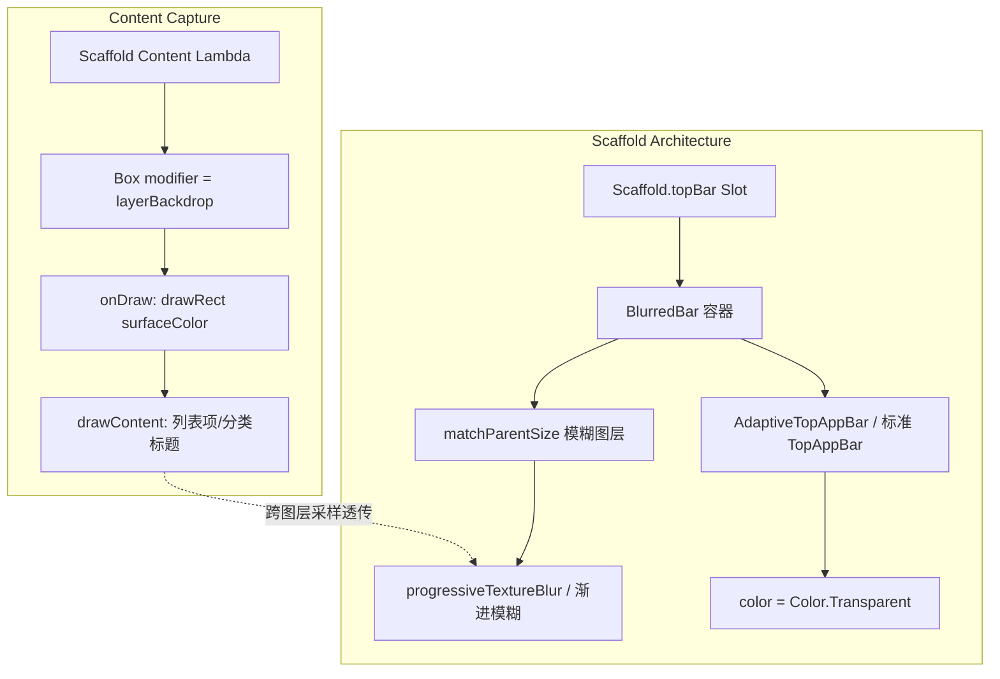

# MIUIX 顶部毛玻璃模糊机制与工程实践深度调研报告

- **调研目标**: 逆向考据 MIUIX (HyperOS) 顶部模糊 (Top App Bar Blur) 的官方标准实现，深入剖析其与当前项目现有写法的架构差异、视觉缺陷与边界隐患，并输出规范化演进方案。
- **官方基线**: `compose-miuix-ui/miuix:0.9.4-rc01` (Commit `4a6b750b578880146876e4ab77097d9b01702413`)
- **项目基线**: `compose-miuix/shared/src/commonMain/kotlin/.../FrostedTopAppBar.kt` 与 `LiquidGlass.kt`

---

## 1. 核心原理与心智模型 (Mental Model)

### 1.1 官方设计理念 (The Canonical Pattern)
在 MIUIX / Xiaomi HyperOS 设计哲学中，沉浸式顶栏毛玻璃的核心心智模型由三个支柱构成：
1. **渐进过渡而非机械硬截断 (Progressive Fade)**：顶栏不是一个固定的均一模糊矩形，而是从顶部状态栏区向下方平滑衰减的渐进式模糊 (`ProgressiveBlur.Top`)，底部边缘为 100% 像素级清晰，与列表内容自然融合，无视觉断层。
2. **滚动动态涌现 (Dynamic Scroll Emergence)**：在页面停靠于顶部 (`contentOffset == 0`) 时，模糊层与磨砂着色完全透明 (`alpha = 0f`)；仅当用户向上滑动、内容真正穿行至顶栏背后时，毛玻璃才在 48dp 阈值内平滑淡入。
3. **组合优于侵入 (Composition over Duplication)**：顶栏组件 (`TopAppBar` / `SmallTopAppBar`) 保持纯粹的标准组件职责，外层通过轻量包装器 (`BlurredBar`) 挂载模糊，通过透明背景参数解耦渲染。



### 1.2 现有实现心智模型 (The Existing Workaround Pattern)
当前项目采用的是典型的“机械规避式补丁模型”：
由于初期使用均一模糊导致下方 `SmallTitle` 被切割、文字产生暗黑脏块，现有实现将模糊区域硬编码限制在 `statusBars + 56.dp` 的极小矩形内，并将表面磨砂不透明度调至极高的 `0.96f`，甚至在 56dp 处强行绘制分割线来掩盖截断痕迹。

---

## 2. 端到端渲染与调用链路 (Call Tree)

### 2.1 官方渲染流水线 (Official Pipeline)
```text
Scaffold(topBar = { BlurredBar(...) { TopAppBar(...) } })
  ├── BlurredBar (PageUtils.kt:128)
  │     ├── rememberBlurBackdrop (PageUtils.kt:117)
  │     │     ├── isRuntimeShaderSupported() [API 33+ / Skiko 检测]
  │     │     └── rememberLayerBackdrop { drawRect(surfaceColor); drawContent() }
  │     ├── Box [容器测量 TopAppBar 实际尺寸]
  │     │     ├── Box.matchParentSize()
  │     │     │     ├── graphicsLayer { alpha = (-contentOffset / 48.dp).coerceIn(0f, 1f) }
  │     │     │     └── Modifier.progressiveTextureBlur (TextureEffect.kt:208)
  │     │     │           └── drawBackdrop (TextureEffect.kt:274)
  │     │     │                 └── BackdropEffectScope.progressiveTextureBlurEffect (BackdropEffects.kt:147)
  │     │     │                       ├── noiseDither(0f)
  │     │     │                       ├── colorControls(brightness, contrast, saturation)
  │     │     │                       ├── progressiveBlur(radius * density, gradient = ProgressiveBlur.Top.copy(curve = 2.2f))
  │     │     │                       └── blendColors(surface.copy(alpha = 0.3f))
  │     │     └── content() -> TopAppBar(color = Color.Transparent)
  └── Scaffold.content
        └── Box(Modifier.layerBackdrop(backdrop))
              └── LazyColumn(contentPadding = innerPadding)
```

### 2.2 现有实现调用链路 (Existing Pipeline)
```text
Scaffold(topBar = { FrostedTopAppBar(...) })
  ├── FrostedTopAppBar (FrostedTopAppBar.kt:30)
  │     ├── 计算 pinnedHeaderHeight = statusBarTop + 56.dp [硬编码]
  │     ├── 计算 outlineAlpha = (collapsedFraction * 0.15f)
  │     ├── Box(Modifier.fillMaxWidth())
  │     │     ├── Box [仅高度为 pinnedHeaderHeight]
  │     │     │     ├── Modifier.backdropBlur (LiquidGlass.kt:202)
  │     │     │     │     └── drawBackdrop
  │     │     │     │           ├── effects = { blur(20.dp, 20.dp) } [全量均一模糊]
  │     │     │     │           └── onDrawSurface = { drawRect(surface.copy(alpha = 0.96f)) } [96% 实体遮盖]
  │     │     │     └── drawBehind { drawLine(...) } [56dp 处绘制手工分割线]
  │     │     └── TopAppBar(color = Color.Transparent)
  └── Scaffold.content
        └── Box(Modifier.layerBackdrop(backdrop)) [无 onDraw 底色兜底]
```

---

## 3. 关键机制代码深度考据 (Code Excavation)

### 3.1 官方实现核心代码考据

#### 1. 动态透明度与渐进模糊图层 (`PageUtils.kt:128-175`)
```kotlin
@Composable
fun rememberBlurBackdrop(): LayerBackdrop? {
    val appState = LocalAppState.current
    if (!appState.enableBlur || !isRuntimeShaderSupported()) return null
    val surfaceColor = MiuixTheme.colorScheme.surface
    return rememberLayerBackdrop {
        drawRect(surfaceColor) // 确保捕获层有不透明底色，杜绝透明边缘采样导致的暗黑脏块
        drawContent()
    }
}

@Composable
fun BlurredBar(
    backdrop: LayerBackdrop?,
    blurEnabled: Boolean,
    scrollBehavior: ScrollBehavior? = null,
    content: @Composable () -> Unit,
) {
    val progressive = LocalAppState.current.blurStyle == 1
    val blurActive = blurEnabled && backdrop != null
    Box(
        modifier = if (blurActive && !progressive) {
            Modifier.textureBlur(
                backdrop = backdrop,
                shape = RectangleShape,
                blurRadius = 25f,
                colors = barBlurColors(),
            )
        } else {
            Modifier
        },
    ) {
        if (blurActive && progressive) {
            Box(
                modifier = Modifier
                    .matchParentSize()
                    .graphicsLayer {
                        // 初始顶部停靠时 alpha = 0f；滚动时在 48dp 内平滑淡入
                        alpha = scrollBehavior?.state
                            ?.let { (-it.contentOffset / 48.dp.toPx()).coerceIn(0f, 1f) }
                            ?: 1f
                    }
                    .progressiveTextureBlur(
                        backdrop = backdrop,
                        shape = RectangleShape,
                        // 顶部最强向底部渐隐，curve = 2.2f 平滑收尾，绝无边缘切割
                        gradient = ProgressiveBlur.Top.copy(curve = 2.2f),
                        blurRadius = 10f,
                        colors = barBlurColors(progressive = true),
                    ),
            )
        }
        content()
    }
}

@Composable
private fun barBlurColors(progressive: Boolean = false): BlurColors = BlurDefaults.blurColors(
    blendColors = listOf(
        // 渐进模式下表面色 Alpha 仅需 0.3f (30%)，兼顾通透毛玻璃与对比度
        BlendColorEntry(color = MiuixTheme.colorScheme.surface.copy(if (progressive) 0.3f else 0.8f)),
    ),
)
```

#### 2. 渐进模糊与着色管道 (`miuix-blur/ProgressiveBlur.kt` & `TextureEffect.kt`)
```kotlin
// 渐进模糊方向与幂指数定义
data class ProgressiveBlur(
    val angle: Float = 90f,
    val startFraction: Float = 0f,
    val endFraction: Float = 1f,
    val curve: Float = 1f,
) {
    companion object {
        val Top: ProgressiveBlur = ProgressiveBlur(angle = 90f, startFraction = 0f, endFraction = 1f)
    }
}
```

---

## 4. 核心维度差异全景对比 (Comprehensive Comparison)

| 核心维度 | 官方标准写法 (compose-miuix-ui) | 当前项目现有写法 (pixez-flutter-MIUIX) | 现有写法劣势与风险 |
| :--- | :--- | :--- | :--- |
| **模糊形态** | **渐进式过渡 (`progressiveTextureBlur`)**<br>状态栏向底缘平滑衰减至 0，无任何硬边界 | **均一模糊 + 物理强行切断 (`blur(20.dp)`)**<br>在 56dp 处被 Box 边界物理截断 | 在 56dp 处产生生硬光学断层，破坏设计连续性 |
| **滚动响应** | **动态涌现 (`graphicsLayer.alpha`)**<br>`contentOffset == 0` 时透明度为 0；滚动 48dp 动态淡入 | **静态常驻不透明**<br>即使处于列表顶部，也常驻一块厚重的磨砂矩形 | 失去 HyperOS 原生动态响应质感，静态时顶栏显突兀 |
| **表面磨砂层** | `BlendColorEntry(surface.copy(alpha = 0.3f))` (渐进模式)<br>透光率高，高斯散斑与通透度兼备 | `onDrawSurface = { drawRect(color.copy(0.96f)) }`<br>高达 96% 的实体着色 | 几乎退化为纯色矩形，毛玻璃质感丧失殆尽 |
| **高度适配** | **自适应 (`matchParentSize()`)**<br>自动随 `TopAppBar` 展开 (~152dp) 与折叠 (~50dp) 同步缩放 | **硬编码 (`statusBarTop + 56.dp`)**<br>大标题展开时，下方大面积区域失去模糊与背景 | 大标题展开时出现严重镂空与文字重叠穿透 |
| **规范尺寸** | 遵循 MIUIX 标头高度 `50.dp`<br>(`TopAppBarDefaults.SmallTopAppBarCenterHeight`) | 错误使用 Material 3 的 `56.dp` 常量 | 与 MIUIX 官方组件实际测量高度存在 6dp 偏差 |
| **采样底色** | `rememberLayerBackdrop { drawRect(surfaceColor); drawContent() }`<br>强制写入不透明底色 | 裸 `rememberLayerBackdrop()`<br>依赖页面外部 Box，无强制底色注入 | 透明边沿采样导致 Skia 出现黑边与溢色脏块 |
| **降级兜底** | `if (!enableBlur \|\| !isRuntimeShaderSupported()) return null`<br>API < 33 或不支持时优雅回退纯色 | 页面层无条件初始化 `rememberLayerBackdrop()`，依赖底层吞异常 | 低端设备或低版本存在额外图形开销或潜在崩溃风险 |
| **组件架构** | **非侵入组合包装 (`BlurredBar`)**<br>原生 `TopAppBar` 零修改，仅切换 `color = Transparent` | **侵入式重新造轮子 (`FrostedTopAppBar`)**<br>50+ 个文件产生硬编码自定义组件依赖 | 与 MIUIX 原生更新脱节，维护成本极高 |

---

## 5. 核心不变量与极端边界 (Invariants & Failure Modes)

### 5.1 核心不变量 (Invariants)
1. **Backdrop 不透明背景不变量 (Opaque Background Invariant)**:
   - `LayerBackdrop` 必须在捕获开始的第一帧绘制不透明底层 (`drawRect(surfaceColor)`)。
   - 若缺失此约束，半透明或无背景组件在经过 separable Gaussian 滤波时，透明像素的 Alpha 权重会与内容混合，形成暗灰色伪影（这也是此前写作者注释声称“杜绝暗色文字形成可见脏块”并错误将透明度加至 0.96 的本质根源）。
2. **硬件着色器隔离不变量 (RuntimeShader Capability Invariant)**:
   - Android API < 33 缺少 `RuntimeShader` 支持，必须在顶层入口熔断。未熔断的 Backdrop 链会导致无效的绘制指令与内存泄漏。

### 5.2 性能开销权衡 (Performance Tradeoffs)
- `progressiveTextureBlur` 内部除了降采样高斯核处理外，由于端点处要求 100% 像素级清晰，必须进行一次全分辨率的覆盖混合通道（Full-resolution Overlay Pass）。
- 官方最佳实践明确要求：**仅在 Narrow Edge Bands（如顶栏、底栏）使用渐进模糊，严禁在大面积视口全屏启用**。顶栏应用 `matchParentSize()` 且仅覆盖 AppBar 区域是性能与视觉的最优解。

---

## 6. 演进与重构落地建议 (Actionable Recommendations)

### 6.1 第一阶段：统一引入 `BlurredBar` 并优化采样源
1. 在 `com.perol.pixez.shared.ui.components` 下沉淀官方标准的 `BlurredBar.kt` 与 `rememberBlurBackdrop()` 工具函数。
2. 修复 `rememberBlurBackdrop`，加入 `drawRect(surfaceColor)` 兜底，消除暗黑脏块隐患。

### 6.2 第二阶段：平滑替换 `FrostedTopAppBar`
1. 将现有 50+ 个页面中的 `FrostedTopAppBar` 逐步退役，恢复为标准官方 `TopAppBar` / `SmallTopAppBar`。
2. 采用结构：
   ```kotlin
   Scaffold(
       topBar = {
           BlurredBar(backdrop, blurActive, scrollBehavior) {
               TopAppBar(
                   title = title,
                   color = if (blurActive) Color.Transparent else MiuixTheme.colorScheme.surface,
                   scrollBehavior = scrollBehavior,
                   ...
               )
           }
       }
   )
   ```
3. 移除 `pinnedHeaderHeight = statusBarTop + 56.dp` 硬编码及 `outlineAlpha` 人工细线。

### 6.3 第三阶段：多语言与主题联动收敛
1. 表面磨砂透明度从现有的 `0.96f` 降低至官方标准的 `0.3f`，配合 `ProgressiveBlur.Top.copy(curve = 2.2f)` 展现真正的 HyperOS 高级毛玻璃质感。
2. 完善低版本 Android (API < 33) 的实色降级策略。
